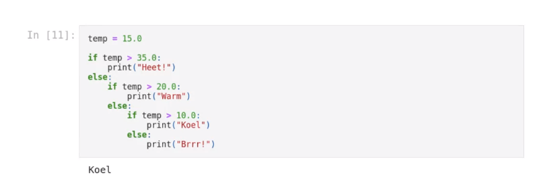

# Tuesday 14 September - HC

Notes on the lecture of programming 1 on 14 September 2021. Pop-OS doesn't come
with the Dutch language pack, so `spellright` can't check me. English it is

We're going to make use python, apparently most popular (really? okay 4th place)

---

Conditional statements with `if`, `elif` (python else if I guess) and `else`.

Example used by the teacher:

```py
if grade > 7.5:
  print("Goed")
elif grade > 5.5:
  print("Voldoende")
else:
  print("Onvoldoende")
```

uh what


---

Turning in the assignments and homework will have to be done through a online
program called `gradescope`. The grading will be done manually but if there is
a syntax error in the code `gradescope` will automatically show you the error,
unsure if you can fix the error before grading tho.

The teachers make use of a program called Anaconda for the python installation.
We are allowed to use a normal installation of python though, packages we have
to use are not installed by default. Not sure what all the packages are we have
to use but one of them is `ipython`.

---

Why did I make notes for this? Why did I follow this lecture? I honestly don't
know.
